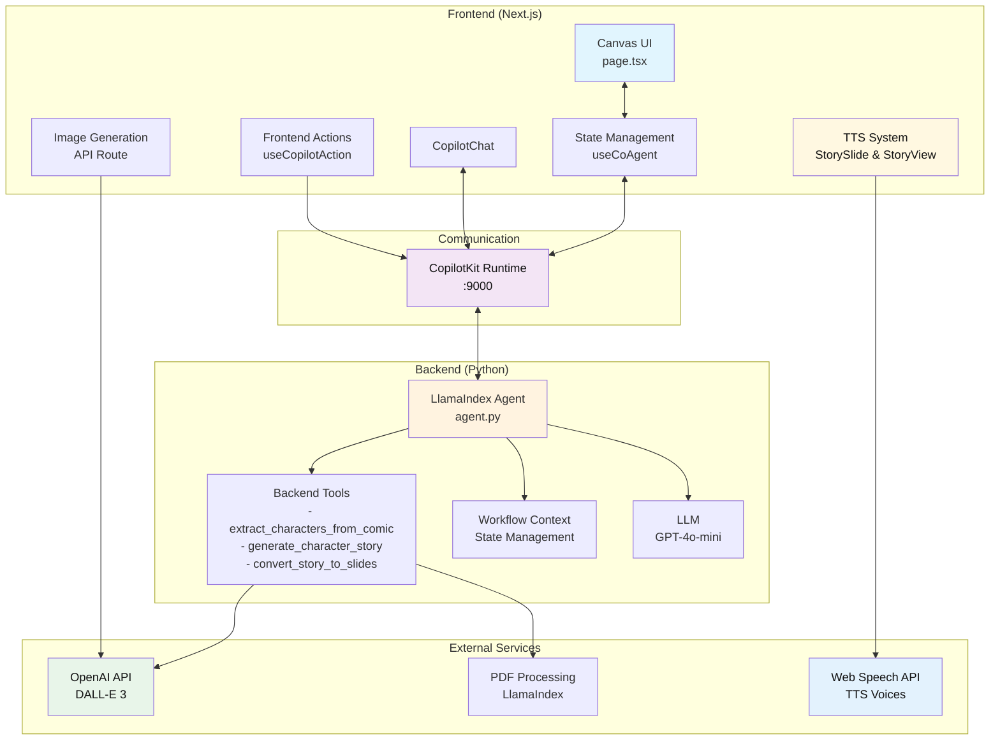
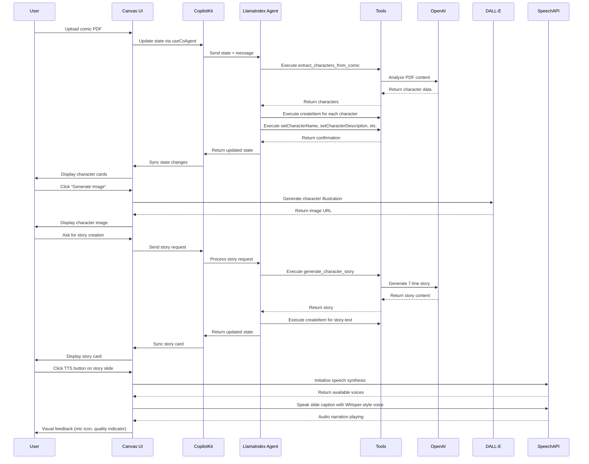

# Tiny Legends: AI-Powered Children's Story Creation Platform

Welcome to Tiny Legends! An innovative AI-powered platform that transforms comic books into interactive children's stories through intelligent character extraction, story generation, and visual storytelling. Built with [LlamaIndex](https://developers.llamaindex.ai), [CopilotKit](https://docs.copilotkit.ai), and [OpenAI](https://openai.com).

## About Tiny Legends
Tiny Legends is a complete AI-powered platform that creates engaging, age-appropriate content for children aged 5-10. It combines comic book analysis, AI character extraction, story generation, and visual storytelling to create interactive educational experiences. The platform uses advanced AI models to automatically extract characters from comics, generate age-appropriate stories, and create illustrated story slides with narration.

### 🎥 Demo Video
Watch Tiny Legends in action: [https://youtu.be/dog5FwRDRKM](https://youtu.be/dog5FwRDRKM)

## Core Features

### 🎭 AI Character Extraction
- **PDF Comic Analysis**: Upload comic PDFs and automatically extract character names, descriptions, and traits
- **Smart Character Cards**: AI-generated character profiles with detailed descriptions and visual traits
- **DALL-E 3 Illustrations**: Automatic character illustration generation using OpenAI's DALL-E 3

### 📚 Story Generation
- **Age-Optimized Content**: Creates 7-line stories specifically tailored for 7-year-olds
- **Character Integration**: Stories feature extracted characters in engaging narratives
- **Educational Focus**: Promotes literacy, creativity, and storytelling skills

### 🎨 Visual Storytelling
- **Story Slides**: Converts text stories into 9 illustrated story cards
- **Interactive Canvas**: Drag-and-drop interface for easy content management
- **Real-time Editing**: Live updates and state synchronization

### 🎤 Audio Narration
- **Whisper-Style TTS**: High-quality text-to-speech with natural voice synthesis
- **Auto-Play Functionality**: Automatic slide advancement with narration
- **Voice Customization**: Multiple voice options with quality indicators

## How It Works

1. **Upload Comic**: Drag and drop a PDF comic file to the canvas
2. **Character Extraction**: AI analyzes the comic and extracts character information
3. **Auto-Population**: Character cards are automatically created with descriptions and illustrations
4. **Story Generation**: Ask the AI to create a story using the extracted characters
5. **Visual Story Slides**: Convert the story into illustrated slides with narration
6. **Interactive Experience**: Edit, rearrange, and customize all content through the visual interface

## Getting Started

### Prerequisites
Before running Tiny Legends, ensure you have the following installed:
- **Node.js 20+** - For the frontend application
- **Python 3.10+** - For the AI agent backend
- **OpenAI API Key** - Required for AI character extraction and story generation
- **uv** - Python package manager ([installation guide](https://docs.astral.sh/uv/getting-started/installation/))
- **Package Manager** - Choose one:
  - [pnpm](https://pnpm.io/installation) (recommended)
  - npm
  - [yarn](https://classic.yarnpkg.com/lang/en/docs/install/#mac-stable)
  - [bun](https://bun.sh/)

### 📚 Documentation
- [LlamaIndex Documentation](https://developers.llamaindex.ai/python/workflows) - AI agent framework
- [CopilotKit Documentation](https://docs.copilotkit.ai) - Frontend-backend integration
- [OpenAI API Documentation](https://platform.openai.com/docs) - AI model integration
- [Next.js Documentation](https://nextjs.org/docs) - Frontend framework

### Quickstart

1. **Clone and Install Dependencies**
   ```bash
   git clone <repository-url>
   cd tiny_legends
   
   # Install dependencies (both Node.js and Python)
   pnpm install
   ```

2. **Set up Environment Variables**
   
   Create `agent/.env` file:
   ```bash
   # Required: OpenAI API key for AI features
   OPENAI_API_KEY="your-openai-api-key-here"
   ```
   
   Get your OpenAI API key from [platform.openai.com/api-keys](https://platform.openai.com/api-keys)

3. **Start the Development Servers**
   ```bash
   # Start both frontend and backend
   pnpm dev
   ```
   
   This will start:
   - Frontend: http://localhost:3001
   - Backend Agent: http://localhost:9000

4. **Start Creating Stories!**
   
   Open http://localhost:3001 and:
   - Upload a comic PDF file by dragging it to the canvas
   - Watch as AI extracts characters and creates character cards
   - Ask the AI to generate a story: "Create a story using the characters on the canvas"
   - Convert the story to slides: "Create story slides from the generated story"
   - Use the TTS feature to hear narration

## Usage Guide

### 🎭 Character Extraction
1. **Upload Comic**: Drag and drop a PDF comic file to the canvas
2. **AI Analysis**: The system automatically extracts character information
3. **Character Cards**: View auto-generated character cards with descriptions
4. **Generate Images**: Click "Generate Image" on character cards to create DALL-E 3 illustrations

### 📚 Story Creation
1. **Generate Story**: Ask the AI: "Create a story using the characters on the canvas"
2. **Story Card**: A story card will appear with the generated narrative
3. **Edit Story**: Click on the story text to edit directly

### 🎨 Story Slides
1. **Create Slides**: Ask the AI: "Create story slides from the generated story"
2. **Visual Story**: 9 illustrated story cards will be created
3. **Edit Slides**: Click on any slide to edit the caption or illustration prompt
4. **Rearrange**: Drag and drop slides to reorder the story

### 🎤 Audio Narration
1. **TTS Button**: Click the microphone button (🎤) on any story slide
2. **Voice Selection**: Choose from available voices using the dropdown
3. **Auto-Play**: Enable auto-play to automatically advance through slides
4. **Keyboard Shortcut**: Press 'T' key in StoryView mode to toggle narration

### 🎯 AI Commands
Try these natural language commands:
- "Extract characters from this comic"
- "Create a story about friendship"
- "Make the story more exciting"
- "Add more details to the character descriptions"
- "Create story slides with illustrations"


## Available Scripts

Run these commands using your preferred package manager (pnpm, npm, yarn, or bun):

- `dev` - Starts both frontend and AI agent servers concurrently
- `dev:debug` - Starts development servers with debug logging enabled
- `dev:ui` - Starts only the Next.js frontend server (port 3001)
- `dev:agent` - Starts only the Python AI agent server (port 9000)
- `install:agent` - Installs Python dependencies for the AI agent
- `build` - Builds the Next.js application for production
- `start` - Starts the production server
- `lint` - Runs ESLint for code linting

## Architecture Overview

### System Architecture


</details>

### Data Flow


### Frontend (Next.js + CopilotKit)
The main UI component is in [`src/app/page.tsx`](src/app/page.tsx). It includes:
- **Canvas Management**: Visual grid of character cards, story cards, and story slides
- **State Synchronization**: Uses `useCoAgent` hook for real-time state sync with the AI agent
- **Frontend Actions**: Exposed as tools to the AI agent via `useCopilotAction`
- **Character Management**: Drag-and-drop interface for character cards with image generation
- **Story Creation**: Interactive story generation and editing capabilities
- **TTS Integration**: Audio narration system with voice selection and auto-play
- **File Upload**: PDF comic upload with drag-and-drop functionality

### Backend (LlamaIndex Agent)
The agent logic is in [`agent/agent/agent.py`](agent/agent/agent.py). It features:
- **Character Extraction**: Analyzes PDF comics to extract character information
- **Story Generation**: Creates age-appropriate stories using extracted characters
- **Slide Conversion**: Converts text stories into illustrated story slides
- **Tool Integration**: Backend tools for comic processing and story creation
- **State Management**: Uses LlamaIndex's Context for workflow state management
- **AI Integration**: GPT-4o-mini for text processing and DALL-E 3 for image generation
- **FastAPI Router**: Uses `get_ag_ui_workflow_router` for seamless frontend integration
</details>

### Data Schema

#### Card Types
Each card type has specific fields defined in the system:
- **Character**: name (text), description (textarea), traits (tags), image (URL)
- **Story**: content (textarea), title (text), characters (array of character IDs)
- **Story Slide**: caption (text), illustration_prompt (text), slide_number (number)

#### Character Card Fields
- **Name**: Character's name (required)
- **Description**: Detailed character description and background
- **Traits**: Array of character traits and characteristics
- **Image**: Generated DALL-E 3 illustration URL

#### Story Card Fields
- **Title**: Story title (auto-generated or user-editable)
- **Content**: 7-line story content optimized for 7-year-olds
- **Characters**: References to character cards used in the story

#### Story Slide Fields
- **Caption**: Text content for the slide
- **Illustration Prompt**: Detailed prompt for DALL-E 3 image generation
- **Slide Number**: Position in the story sequence (1-9)

## Customization Guide

### Adding New Card Types
1. Define the data schema in [`src/lib/canvas/types.ts`](src/lib/canvas/types.ts)
2. Add the card type to the `CardType` union
3. Create rendering logic in [`src/components/canvas/CardRenderer.tsx`](src/components/canvas/CardRenderer.tsx)
4. Update the agent's field schema in [`agent/agent/agent.py`](agent/agent/agent.py)
5. Add corresponding frontend actions in [`src/app/page.tsx`](src/app/page.tsx)

### Modifying Existing Cards
- Field definitions are in the agent's FIELD_SCHEMA constant
- UI components are in [`CardRenderer.tsx`](src/components/canvas/CardRenderer.tsx)
- Frontend actions follow the pattern: `set[Type]Field[Number]`

### Styling
- Global styles: [`src/app/globals.css`](src/app/globals.css)
- Component styles use Tailwind CSS with shadcn/ui components
- Theme colors can be modified via CSS custom properties
- See CopilotKit's [customization docs](https://docs.copilotkit.ai/llamaindex/custom-look-and-feel/customize-built-in-ui-components) for the chat window

### Adding New AI Features
- Backend tools are defined in [`agent/agent/agent.py`](agent/agent/agent.py)
- Frontend actions are in [`src/app/page.tsx`](src/app/page.tsx)
- API routes are in [`src/app/api/`](src/app/api/)

## Troubleshooting

### Agent Connection Issues
If you see "I'm having trouble connecting to my tools":
1. The LlamaIndex agent is running on port 9000 (check terminal output)
2. Your OpenAI API key is set correctly in `agent/.env`
3. Both servers started successfully (UI and agent)

### Port Already in Use
If you see "[Errno 48] Address already in use":
1. The agent might still be running from a previous session
2. Kill the process using the port: `lsof -ti:9000 | xargs kill -9`
3. For the UI port: `lsof -ti:3001 | xargs kill -9`

### State Synchronization Issues
If the canvas and AI seem out of sync:
1. Check the browser console for errors
2. Ensure all frontend actions are properly registered
3. Verify the agent is using the latest shared state (not cached values)

### Character Extraction Issues
If character extraction is not working:
1. Ensure the PDF file is text-based (not image-only)
2. Check that the OpenAI API key has sufficient credits
3. Verify the PDF file is not corrupted or password-protected

### Image Generation Issues
If character images are not generating:
1. Verify your OpenAI API key has DALL-E 3 access
2. Check that you have sufficient API credits
3. Ensure the character description is not empty

### TTS Issues
If text-to-speech is not working:
1. Check that your browser supports the Web Speech API
2. Ensure you have available voices on your system
3. Try refreshing the page to reload voice options

### Python Dependencies
If you encounter Python import errors:
```bash
cd agent
uv sync
```

### Dependency Conflicts
If issues persist, recreate the virtual environment:
```bash
cd agent
rm -rf .venv
uv venv
uv sync
```

---

## Contributing

Feel free to submit issues and enhancement requests! This starter is designed to be easily extensible.

## License

This project is licensed under the MIT License - see the LICENSE file for details.

> [!IMPORTANT]
> Some features are still under active development and may not yet work as expected. If you encounter a problem using this template, please [report an issue](https://github.com/CopilotKit/canvas-with-llamaindex/issues/new/choose) to this repository.
