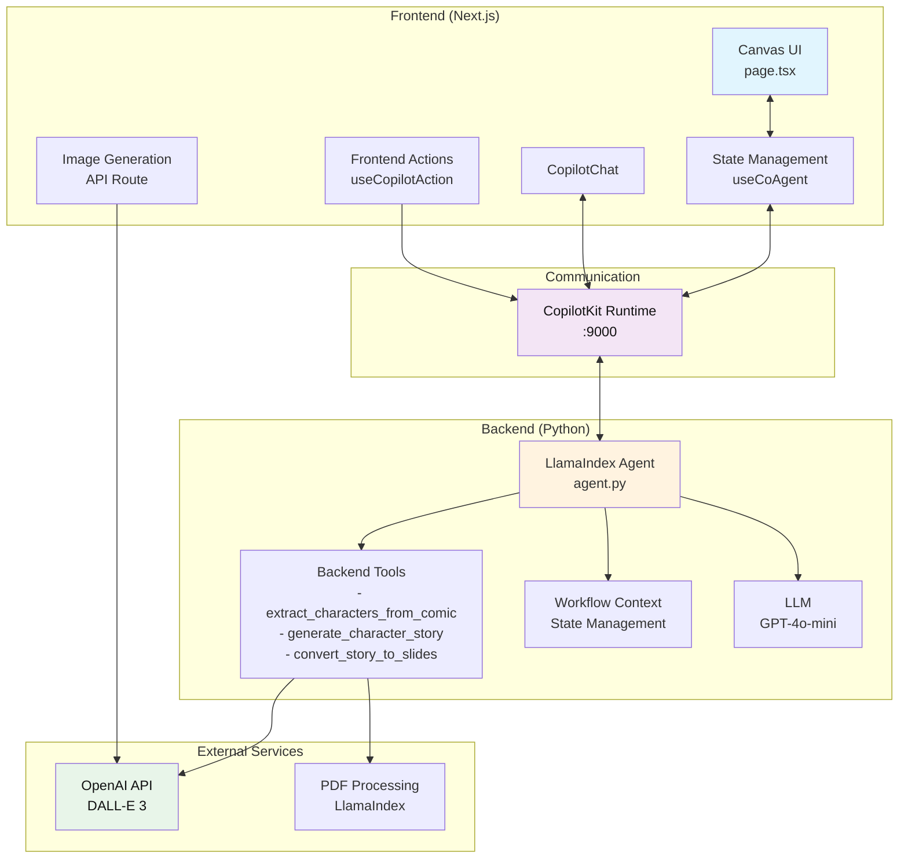
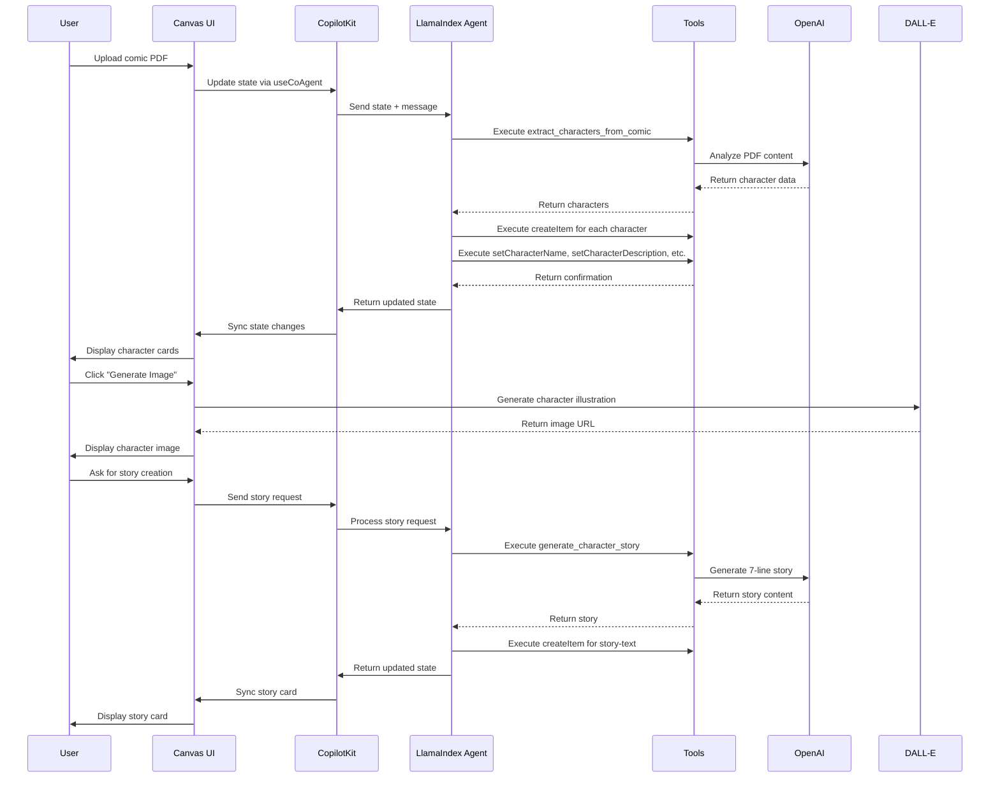

# **Tiny Legends: AI-Powered Children's Story Creation Platform**

## **Project Overview**

Tiny Legends is an innovative AI-powered platform that transforms comic books into interactive children's stories through intelligent character extraction, story generation, and visual storytelling. Built on a modern fullstack architecture, it combines LlamaIndex agents, CopilotKit UI integration, and OpenAI's DALL-E 3 to create engaging, age-appropriate content for children aged 5-10. AG-UI protocol is ofcourse the skeleton of all. This also integrates with Drive to pick up comics from there using composio.

## **Core Flow**

1. **Comic Upload & Processing**: Users upload PDF comic files through a drag-and-drop interface
2. **AI Character Extraction**: LlamaIndex agent analyzes comic content using GPT-4o-mini to extract character names, descriptions, and traits
3. **Auto-Populated Character Cards**: Characters are automatically created as interactive cards with AI-generated descriptions and DALL-E 3 illustrations
4. **Story Generation**: AI creates 7-line stories (optimized for 7-year-olds) featuring extracted characters
5. **Visual Story Slides**: Stories are converted into 9 illustrated story cards with detailed illustration prompts and narration scripts
6. **Interactive Canvas**: Users can edit, rearrange, and customize all content through an intuitive visual interface

## **Judging Criteria Compliance**

### **🏃 Running Code & Reliability**
- **✅ Fully Functional**: Complete end-to-end workflow from comic upload to story creation
- **✅ Error Handling**: Comprehensive error handling with fallback mechanisms for JSON parsing, API failures, and file processing
- **✅ Process Management**: Automated cleanup scripts and port conflict resolution
- **✅ State Synchronization**: Real-time bidirectional sync between frontend and backend using CopilotKit's `useCoAgent`
- **✅ Production Ready**: Environment variable management, proper API key handling, and deployment configuration

### **🔗 Fullstack Agent Integration (Retrieval, Tool Actions, UI)**
- **✅ Advanced Retrieval**: PDF text extraction using LlamaIndex's PDFReader for accurate character extraction
- **✅ Comprehensive Tool Actions**: 15+ frontend actions and 4 backend tools for complete workflow automation
- **✅ Seamless UI Integration**: CopilotKit's `useCopilotAction` hooks enable direct agent-to-UI communication
- **✅ Real-time Updates**: Instant UI updates through state management and tool execution
- **✅ Multi-modal Processing**: Text analysis, image generation, and structured data extraction

### **🏗️ System Design & Observability**
- **✅ Microservices Architecture**: Separate Next.js frontend (port 3001) and Python agent backend (port 9000)
- **✅ Clear Separation of Concerns**: Frontend handles UI/UX, backend manages AI processing and business logic
- **✅ Comprehensive Logging**: Detailed console logging for all tool calls, API requests, and state changes
- **✅ Type Safety**: Full TypeScript implementation with strict type checking
- **✅ Scalable Design**: Modular component architecture with reusable UI components

### **🎨 UX & Agentic Experience**
- **✅ Intuitive Interface**: Clean, modern UI with drag-and-drop functionality and visual feedback
- **✅ AI-Guided Workflow**: Smart suggestions and automated population of character cards
- **✅ Interactive Canvas**: Visual card-based interface for easy content management
- **✅ Real-time Collaboration**: Live updates and state synchronization
- **✅ Age-Appropriate Design**: Child-friendly interface with colorful, engaging visuals

### **🚀 Innovation & Impact**
- **✅ Novel Approach**: First platform to combine comic analysis with AI story generation for children
- **✅ Educational Value**: Promotes literacy, creativity, and storytelling skills in children
- **✅ Accessibility**: Makes complex AI technology accessible through simple, intuitive interface
- **✅ Scalability**: Architecture supports multiple comic formats and story types
- **✅ Future-Ready**: Extensible design for additional features like audio narration and animation

### **📺 Demo & Communication**
- **✅ Clear Documentation**: Comprehensive README with setup instructions and architecture diagrams
- **✅ Live Demo Ready**: One-command setup with `pnpm run dev`
- **✅ Visual Architecture**: Mermaid diagrams showing system components and data flow
- **✅ Troubleshooting Guide**: Detailed error resolution and debugging instructions

## **Architecture Notes**

### **Frontend (Next.js 15 + React 19)**
- **Canvas Management**: Visual grid system with drag-and-drop card creation
- **State Management**: CopilotKit's `useCoAgent` for real-time agent synchronization
- **Component Architecture**: Modular design with reusable UI components (shadcn/ui)
- **Type Safety**: Full TypeScript implementation with strict type checking

### **Backend (Python + LlamaIndex)**
- **Agent System**: LlamaIndex workflow router with GPT-4o-mini integration
- **Tool Integration**: 4 backend tools for comic processing, story generation, and character extraction
- **API Design**: RESTful endpoints with proper error handling and validation
- **File Processing**: PDF text extraction and image generation capabilities

### **AI Integration**
- **OpenAI GPT-4o-mini**: Primary LLM for character extraction and story generation
- **DALL-E 3**: Image generation for character illustrations
- **LlamaIndex**: Document processing and agent orchestration
- **CopilotKit**: Seamless frontend-backend communication

## **Demo/Run Steps**

```bash
# 1. Clone and setup
git clone <repository>
cd tiny_legends
pnpm install

# 2. Environment setup
cp agent/.env.example agent/.env
# Add OPENAI_API_KEY to agent/.env

# 3. Start development servers
pnpm run dev
# Opens http://localhost:3001

# 4. Upload a comic PDF
# Drag and drop a PDF file to trigger character extraction

# 5. Generate story
# Ask AI: "Create a story using the characters on the canvas"

# 6. Create story slides
# Ask AI: "Create story slides from the generated story"
```

## **Reproducibility & Deployment**

### **Technologies Used**
- **Frontend**: Next.js 15, React 19, TypeScript, Tailwind CSS, shadcn/ui
- **Backend**: Python 3.10+, LlamaIndex, FastAPI, Uvicorn
- **AI Models**: OpenAI GPT-4o-mini, DALL-E 3
- **Integration**: CopilotKit, LlamaIndex AG-UI Protocol
- **Package Management**: pnpm, uv
- **Development**: Concurrently, ESLint, TypeScript

### **Deployment Requirements**
- Node.js 20+
- Python 3.10+
- OpenAI API Key
- 2GB RAM minimum
- Ports 3001 (frontend) and 9000 (backend)

### **Known Limitations**
- PDF processing limited to text-based comics (no image analysis)
- Image generation requires OpenAI API credits
- Single-user system (no multi-tenancy)
- English language only
- Maximum 10MB file upload size

## **Innovation Highlights**

1. **AI-Powered Character Extraction**: Automatically identifies and profiles characters from comic content
2. **Age-Optimized Story Generation**: Creates stories specifically tailored for 7-year-olds with appropriate vocabulary and themes
3. **Visual Story Transformation**: Converts text stories into illustrated story cards with detailed prompts
4. **Seamless Agent Integration**: Real-time communication between AI agent and UI without manual intervention
5. **Educational Focus**: Promotes literacy and creativity through interactive storytelling

This platform demonstrates the power of combining modern AI capabilities with thoughtful UX design to create meaningful educational tools for children.

## **System Architecture Diagram**



## **Data Flow Sequence**


